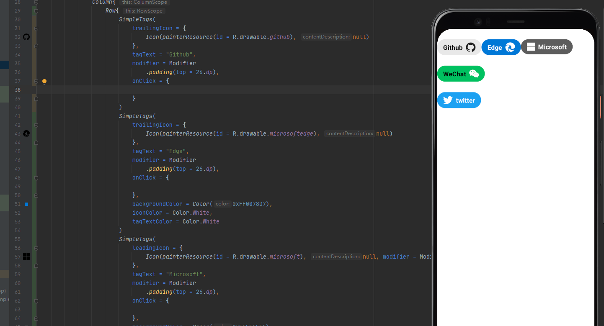

# SimpleTags
## Create a variety of tags simply and easily
## Out of the box

[](https://jitpack.io/#compose-museum/SimpleTags)



``` kotlin
@Composable
fun SimpleTags(
    modifier: Modifier = Modifier,
    shape: Shape = CircleShape,
    elevation: Dp = 0.dp,
    leadingIcon: @Composable (() -> Unit)? = null,
    trailingIcon: @Composable (() -> Unit)? = null,
    text: String,
    textStyle: TextStyle = TextStyle(
        fontWeight = FontWeight.Normal,
        fontSize = 16.sp,
        letterSpacing = 0.15.sp
    ),
    backgroundColor: Color = Color(0xFFE8E8E8),
    onClick:() -> Unit
)
```

## you can copy the code [here](https://github.com/compose-museum/SimpleTags/blob/master/simpletags/src/main/java/org/compose/museum/simpletags/SimpleTags.kt) in case you encounter problems related to dependency

## Step 1. Add the JitPack repository to your build file

#### setting.gradle
```
allprojects {
  repositories {
    ...
    maven { url 'https://jitpack.io' }
  }
}
```

## Step 2. Add the dependency

#### build.gradle
```
dependencies {
    implementation 'com.github.compose-museum:SimpleTags:1.4.0'
}
```
